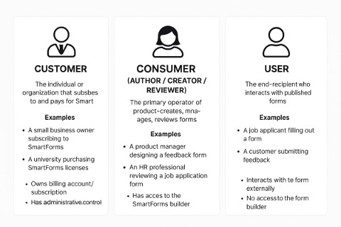

# SmartForms – Business Entity Definitions

## Table of Contents
- [Customer](#1-customer)
- [Consumer (Author / Creator / Reviewer)](#2-consumer-author--creator--reviewer)
- [User](#3-user)
- [Relationship Summary](#relationship-summary)
- [Data Definitions](#data-definitions)
  - [formRawData](#1-formrawdata)
  - [formUserData](#2-formuserdata)
  - [Key Differences](#key-differences)
- [Versioning Strategy](#versioning-strategy)
  - [Why Versioning Matters](#why-versioning-matters)
  - [Versioned Data Structures](#versioned-data-structures)
  - [Versioning Strategy Options](#versioning-strategy-options)
  - [Versioning Strategy Options (In-Depth)](#versioning-strategy-options-in-depth)
  - [Comparison Table](#comparison-table)
  - [Best Practices](#best-practices)
  - [Auto-Versioning Logic](#auto-versioning-logic)

---

# 1. Customer

**Definition:**  
The Customer is the individual or organization that subscribes to and pays for the SmartForms product or services. This entity holds the commercial relationship with smartform product.

**Examples:**  
- A small business owner subscribing to SmartForms Pro Plan to create client intake forms.
- A university purchasing SmartForms licenses for their departments.

**Key Attributes:**  
- Owns billing account/subscription.
- Can assign roles (consumer/user) within their account.
- Has administrative control over product usage, access, and settings.
- May be an organization (with teams) or an individual.

# 2. Consumer (Author / Creator / Reviewer)

**Definition:**  
The Consumer is the primary operator of the product — the one who creates, manages, reviews, and publishes forms using SmartForms. They use the product to produce value for their end-users.

**Sub-Roles:**  

| Role            | Description |
|-----------------|-------------|
| Author/Creator  | Designs and builds forms using the SmartForms builder. |
| Reviewer        | Reviews, tests, and validates forms before publishing. |

**Examples:**  
- A product manager designing a feedback form.
- An HR professional reviewing a job application form.

**Key Attributes:**  
- Has access to the SmartForms builder.
- Can collaborate with other team members.
- May belong to the same customer account (organization).

# 3. User

**Definition:**  
The User is the end-recipient who interacts with the published forms — typically by viewing, filling, or submitting responses. They do not require a SmartForms account to participate.

**Examples:**  
- A job applicant filling out a SmartForms-powered form.
- A customer submitting feedback through a form embedded in a website.

**Key Attributes:**  
- Interacts with the form externally.
- May be anonymous or optionally identified.
- No access to the form builder or internal platform.

# Relationship Summary

| Role | Platform Access | Form Creation | Form Consumption | Billing Relationship |
|:----|:-----------------|:--------------|:-----------------|:---------------------|
| Customer | ✅ Full Access | ✅ May create | ✅ May use | ✅ Yes |
| Consumer (Author/Reviewer) | ✅ Full Access | ✅ Yes | ✅ May test | ❌ No |
| User | ❌ No Access | ❌ No | ✅ Yes | ❌ No |



---

# Data Definitions

## 1. formRawData

**Definition:**  
`formRawData` represents the structure, layout, and metadata of the form designed by the form creator.

**Purpose:**  
Used to render the form exactly as designed, ensuring visual consistency and logic (e.g., conditional visibility, validations).

**Stored As:** JSON format containing:
- HTML layout
- Element types
- Labels, placeholders
- Styles, colors
- Logic rules
- Field identifiers

**Example:**  
Represents the full structure, layout, styles, and metadata of the designed form

```json
{
  "formId": "contact-form-v1",
  "title": "Contact Us",
  "description": "We would love to hear from you. Please fill out this form.",
  "html": "<form id='contactForm'>\n  <div class='form-group'>\n    <label for='fullName'>Full Name</label>\n    <input type='text' id='fullName' name='fullName' placeholder='Enter your full name' required />\n  </div>\n  <div class='form-group'>\n    <label for='email'>Email</label>\n    <input type='email' id='email' name='email' placeholder='Enter your email address' required />\n  </div>\n  <div class='form-group'>\n    <label for='message'>Message</label>\n    <textarea id='message' name='message' placeholder='Type your message here' rows='4'></textarea>\n  </div>\n  <button type='submit'>Submit</button>\n</form>",
  "elements": [
    {
      "type": "text",
      "name": "fullName",
      "label": "Full Name",
      "placeholder": "Enter your full name",
      "required": true
    },
    {
      "type": "email",
      "name": "email",
      "label": "Email",
      "placeholder": "Enter your email address",
      "required": true
    },
    {
      "type": "textarea",
      "name": "message",
      "label": "Message",
      "placeholder": "Type your message here",
      "rows": 4
    }
  ],
  "styles": {
    "theme": "modern-light",
    "font": "Inter",
    "primaryColor": "#3b82f6",
    "formGroupClass": "form-group",
    "buttonClass": "btn btn-primary"
  },
  "validationRules": {
    "email": "email",
    "fullName": "required"
  }
}
```

Conditional Field Example, an example where a “Phone Number” field only appears if the user selects “Phone” as their preferred contact method:

```json
{
  "formId": "contact-form-v2",
  "title": "Contact Us",
  "html": "<form id='contactForm'>\n  <div class='form-group'>\n    <label for='fullName'>Full Name</label>\n    <input type='text' id='fullName' name='fullName' required />\n  </div>\n  <div class='form-group'>\n    <label for='email'>Email</label>\n    <input type='email' id='email' name='email' required />\n  </div>\n  <div class='form-group'>\n    <label for='preferredContact'>Preferred Contact Method</label>\n    <select id='preferredContact' name='preferredContact'>\n      <option value='email'>Email</option>\n      <option value='phone'>Phone</option>\n    </select>\n  </div>\n  <div class='form-group conditional' data-show-if='preferredContact=phone'>\n    <label for='phoneNumber'>Phone Number</label>\n    <input type='tel' id='phoneNumber' name='phoneNumber' />\n  </div>\n  <button type='submit'>Submit</button>\n</form>",
  "elements": [
    {
      "type": "text",
      "name": "fullName",
      "label": "Full Name",
      "required": true
    },
    {
      "type": "email",
      "name": "email",
      "label": "Email",
      "required": true
    },
    {
      "type": "select",
      "name": "preferredContact",
      "label": "Preferred Contact Method",
      "options": ["email", "phone"],
      "required": true
    },
    {
      "type": "tel",
      "name": "phoneNumber",
      "label": "Phone Number",
      "conditional": {
        "field": "preferredContact",
        "value": "phone"
      }
    }
  ],
  "styles": {
    "formGroupClass": "form-group",
    "conditionalClass": "conditional"
  }
}
```

## 2. formUserData

**Definition:**  
`formUserData` represents the actual responses entered by the end-user when interacting with a published form. It captures only the submitted values mapped to field identifiers defined in `formRawData`.

**Purpose:**
Used for data analysis, reporting, storage, or integrating with downstream systems (e.g., sending confirmation emails, saving to CRM).

**Example:**  

```json
{
  "formId": "contact-form-v1",
  "submissionId": "subm-12345678",
  "timestamp": "2025-04-08T12:45:00Z",
  "data": {
    "fullName": "Satya Nataraj",
    "email": "snataraj@everyone.com",
    "message": "Hi there!"
  }
}
```

Conditional Submission:

```json
{
  "formId": "contact-form-v2",
  "submissionId": "subm-987654321",
  "timestamp": "2025-04-08T13:10:00Z",
  "data": {
    "fullName": "Satya Nataraj",
    "email": "snataraj@everyone.com",
    "preferredContact": "phone",
    "phoneNumber": "+1-999-555-1234"
  }
}
```

## Key Differences

| Attribute | formRawData | formUserData |
|:---------|:------------|:------------|
| Purpose | Define form layout | Capture user responses |
| Author | Form creator | End-user |
| Structure | HTML + Metadata | Key-Value pairs |
| Lifecycle | Design time | Submission time |
| Usage | Render UI | Analyze data |

---

# Versioning Strategy

## Why Versioning Matters

- Keep old submissions valid.
- Support audits and analytics.
- Backward compatibility.

## Versioned Data Structures

### formRawData Versioned
Each saved version of the form layout is stored with a version number (or versionId), so multiple versions can coexist.

```json
{
  "formId": "contact-form",
  "version": 3,
  "title": "Contact Us (v3)",
  "html": "<form>...</form>",
  "elements": [...],
  "styles": {...},
  "createdAt": "2025-04-08T12:00:00Z",
  "createdBy": "creator@example.com"
}
```
`formId + version` as `composite key` in DB.

### formUserData Linked to Version
Each submission references the exact version of the form it was created with.

```json
{
  "formId": "contact-form",
  "version": 2,
  "submissionId": "subm-abc123",
  "timestamp": "2025-04-08T12:30:00Z",
  "data": {
    "fullName": "Alice Johnson",
    "email": "alice@example.com"
  }
}
```

## Versioning Strategy Options

| Strategy | Description | Use Case |
|:---------|:------------|:---------|
| Immutable versions | Every change = new version | Audits, compliance |
| Soft overwrite | Latest form ID always points latest | Easy UI |
| Draft + Published | Allow draft edits before publish | Collaborative teams |

## Versioning Strategy Options (In-Depth)

### 1. Immutable Versions

**What It Means:**  
Every time a form is changed and saved, a new immutable version is created. Older versions are never modified and remain accessible.

**When to Use:**  
- Regulatory or audit-driven environments
- Need to preserve exact layouts and rules used at submission time
- Support for long-lived forms with potential schema evolution

**How It Works:**  
- A form with `formId = contact-form` starts at version 1.
- User updates field labels or layout → system creates version 2.
- Submissions reference the version they used.

**Example:**

```json
// formRawData (version 1)
{
  "formId": "contact-form",
  "version": 1,
  "elements": [{ "name": "email", "label": "Email" }]
}

// formRawData (version 2)
{
  "formId": "contact-form",
  "version": 2,
  "elements": [{ "name": "email", "label": "Email Address" }]
}

// formUserData
{
  "formId": "contact-form",
  "version": 1,
  "data": { "email": "user@example.com" }
}
```

**Pros:**  
- Safe, no data corruption risk
- Enables backward compatibility
- Great for audit trail and historical replay

**Cons:**  
- Higher storage requirements
- Needs version lookup logic

---

### 2. Soft Overwrite with Version History

**What It Means:**  
There’s one “main” version of the form (`formId = contact-form`) pointing to the latest content. Previous versions are kept separately.

**When to Use:**  
- Simple UI experience (just 1 active version)
- Want fallback if a change breaks something
- Care about edit history but not rigid version control

**How It Works:**  
- `formId = contact-form` loads latest by default.
- Old versions are stored as `formVersionHistory`.

**Example:**

```json
// Current formRawData
{
  "formId": "contact-form",
  "version": 5,
  "title": "Contact Us"
}

// Historical version
{
  "formId": "contact-form",
  "version": 4,
  "title": "Reach Out to Us"
}

// formUserData
{
  "formId": "contact-form",
  "version": 4,
  "data": { "email": "alice@example.com" }
}
```

**Pros:**  
- Easy for non-technical teams
- Supports rollback
- Simpler than strict immutable strategy

**Cons:**  
- Higher risk of inconsistencies if not managed well
- Must ensure integrity of history

---

### 3. Draft + Published Versions

**What It Means:**  
Changes are saved as drafts, which do not affect the live/public form. Publishing a draft creates a new public version.

**When to Use:**  
- When form creation is collaborative or goes through approvals
- Need to preview/test before going live
- Ideal for large teams, enterprises, CMS-like environments

**How It Works:**  
- Draft: editable, `status: draft`
- Publish: makes a new public version, `status: published`

**Example:**

```json
// Draft form (not live yet)
{
  "formId": "contact-form",
  "version": 3,
  "status": "draft",
  "title": "New Contact Us Form",
  "lastEditedBy": "editor@example.com"
}

// Published form (live to users)
{
  "formId": "contact-form",
  "version": 2,
  "status": "published",
  "title": "Contact Us",
  "publishedBy": "admin@example.com"
}

// formUserData reflects latest published version
{
  "formId": "contact-form",
  "version": 2,
  "data": { "fullName": "Alice Johnson" }
}
```

**Pros:**  
- Allows safe editing without affecting live forms
- Enables preview/testing workflows
- Great for multi-role environments

**Cons:**  
- Requires more complex workflow/UI
- May need role-based access and conflict handling

# 🧩 Comparison Table

| Feature | Immutable Versions | Soft Overwrite | Draft + Published |
|:--------|:-------------------|:---------------|:------------------|
| New version for every change | ✅ Yes | ⚠️ Optional | ✅ On publish |
| Rollback support | ✅ Yes | ✅ Yes | ✅ Yes |
| Simple implementation | ⚠️ Medium | ✅ Yes | ⚠️ Medium-High |
| Best for audits | ✅ Yes | ⚠️ Limited | ✅ Yes |
| Supports drafts | ❌ No | ❌ No | ✅ Yes |
| Storage usage | 📈 Higher | 📉 Moderate | 📉 Moderate |

---

# Auto-Versioning Logic

- On save/edit: If a published form is changed, auto-increment the version number.
- On submit: Save formId + version in formUserData.
- On render: Load latest version by default unless a specific version is requested.

# Best Practices

- Maintain the latest pointer to avoid looking up highest version each time.
- Use migrations or data mapping logic if major schema changes happen.
- Allow rollback to previous versions where possible.
- Lock old versions for compliance needs.
