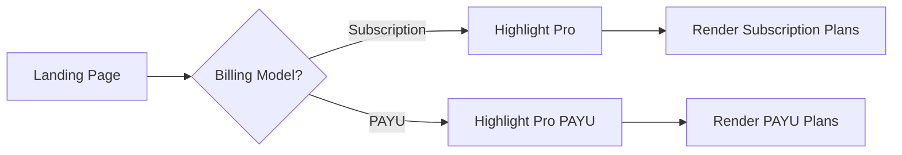
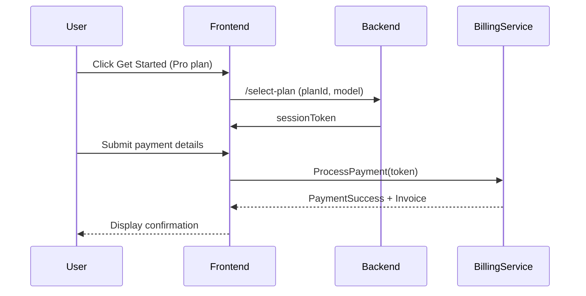

# SmartForms Membership Plans: Business Requirements Document (BRD)

## Table of Contents

1. [Introduction](#introduction)
2. [Business Objectives](#business-objectives)
3. [Scope](#scope)
4. [Glossary](#glossary)
5. [Plan Definitions](#plan-definitions)
   - 5.1 Subscription Plans
   - 5.2 Pay-As-You-Use (PAYU) Plans
6. [Functional Requirements](#functional-requirements)
   - 6.1 Billing Model Toggle Flow
   - 6.2 Plan Selection & Checkout Sequence
   - 6.3 Usage Enforcement & Proration
   - 6.4 Contact-Sales Workflow for Custom Plans
7. [Non-Functional Requirements](#non-functional-requirements)
8. [Integration & Technical Requirements](#integration-technical-requirements)
9. [Acceptance Criteria](#acceptance-criteria)
10. [Diagrams](#diagrams)
    - 10.1 Billing Toggle Flowchart
    - 10.2 Plan Selection Sequence Diagram
11. [Next Steps & Clarifications](#next-steps-clarifications)

---

## 1. Introduction

This BRD defines the business and functional requirements for the SmartForms membership plans. It covers two billing models (Subscription and PAYU), four tiers per model, proration rules, UI/UX behaviors, and integration needs. All requirements are based on stakeholder inputs and do not include assumptions beyond those explicitly provided.

## 2. Business Objectives

- Offer flexible billing models to suit different customer profiles.
- Highlight popular plans to drive conversion (Pro & Pro PAYU).
- Enforce usage limits and automate billing/proration.
- Provide clear upgrade/downgrade and cancellation workflows.
- Support enterprise compliance and custom pricing via sales engagement.

## 3. Scope

**In-Scope:**

- Pricing page UI: toggle, plan cards, comparison table.
- Checkout flows: plan selection, payment, proration logic.
- Usage tracking: submissions & form counts.
- Billing integration: Stripe (initial), alternative gateways later.
- SLA and process documentation for custom plans.

**Out-of-Scope:**

- Trial periods or promotional credits (not planned).
- Detailed workflows beyond placeholders (Basic vs Advanced).

## 4. Glossary

| Term                           | Definition                                                     |
| ------------------------------ | -------------------------------------------------------------- |
| Form                           | A user-created invitation page (e.g., Event Registration).     |
| Submission                     | A single form completion by an end user.                       |
| Proration                      | Adjusting billing amount based on mid-cycle plan changes.      |
| Branding Removal               | Hiding SmartForms logo/branding in embedded forms.             |
| Automation Workflow (Basic)    | Placeholder; initial set of simple triggers/actions.           |
| Automation Workflow (Advanced) | Placeholder; extended AI-driven flows and custom integrations. |

## 5. Plan Definitions

### 5.1 Subscription Plans

| Plan              | Price   | Included Submissions/Month | Features                                   |
| ----------------- | ------- | -------------------------- | ------------------------------------------ |
| Starter           | \$10/mo | 50                         | AI suggestions, Branding removal           |
| **Pro** (Popular) | \$25/mo | 250                        | White-label forms, Advanced AI & workflows |
| Enterprise        | Custom  | Unlimited                  | Compliance support, Priority support       |

### 5.2 PAYU Plans

| Plan                   | Price   | Included Submissions/Month | Extra Fee        | Features                       |
| ---------------------- | ------- | -------------------------- | ---------------- | ------------------------------ |
| Free                   | \$0/mo  | 25                         | \$0.05 per extra | AI suggestions                 |
| Starter PAYU           | \$5/mo  | 50                         | \$0.03 per extra | AI suggestions                 |
| **Pro PAYU** (Popular) | \$15/mo | 100                        | \$0.02 per extra | AI suggestions, Adv. workflows |
| Enterprise PAYU        | Custom  | Unlimited                  | Negotiable       | AI suggestions, Compliance     |

## 6. Functional Requirements

### 6.1 Billing Model Toggle Flow

- **Default State:** On landing, the **Subscription** toggle is active.
- **Plan Highlighting:**
  - Subscription tab: Pro is highlighted by default.
  - PAYU tab: Pro PAYU is highlighted by default.

#### 6.1.1 Flowchart (Section 10.1)

### 6.2 Plan Selection & Checkout Sequence

1. User clicks **Get Started** on desired plan.
2. UI pre-selects billing model & plan in signup flow.
3. User enters account & payment details.
4. System calculates initial charge:
   - Subscription: full monthly fee.
   - PAYU: monthly base fee + 0 overage initially.
5. Confirmation & invoice issuance.

#### 6.2.1 Sequence Diagram (Section 10.2)

### 6.3 Usage Enforcement & Proration

- **Upgrade:** Immediate proration credit for unused days on old plan; charge prorated cost difference.
- **Downgrade:** Takes effect at end of current billing cycle; no mid-cycle limit reduction.
- **Cancellation:** Remains active until current cycle end; no refunds mid-cycle.

### 6.4 Contact-Sales Workflow for Custom Plans

- Industry-standard SDR process:
  1. User clicks **Contact Sales** → lead captured.
  2. Automated email acknowledgment within 1 hour.
  3. Sales rep outreach SLA: < 24 hrs business.
  4. Negotiation, proposal, plan activation via custom setup.

## 7. Non-Functional Requirements

- **Performance:** Pricing page toggle & table render within 200ms.
- **Security:** PCI-DSS compliance for payment flows.
- **Reliability:** 99.9% uptime on billing APIs.
- **Scalability:** Handle 10k plan views per second.

## 8. Integration & Technical Requirements

- **Payment Gateway:** Stripe vNext; design pluggable abstraction for future alternatives.
- **Backend APIs:** Endpoints for plan info, usage metrics, proration, invoicing.
- **Data Storage:** Tenant-based usage logs, audit trails for Enterprise.
- **Notifications:** Email service for usage warnings (≥ 80%).

## 9. Acceptance Criteria

1. Pricing toggle defaults and highlights correctly.
2. Plan entitlements enforced: submission limits, overage fees.
3. Proration logic validated with test scenarios.
4. Custom-plan leads correctly routed; SLA met.
5. Comparison table values match approved designs.

## 10. Diagrams

### 10.1 Billing Toggle Flowchart

### 10.2 Plan Selection Sequence Diagram

## 11. Next Steps & Clarifications

- Validate Basic vs Advanced workflows details.
- Confirm analytics dashboard requirements.
- Define email templates for SLA notifications.
- Review and lock in final UI designs.

---

*Prepared by SmartForms Product Team*

